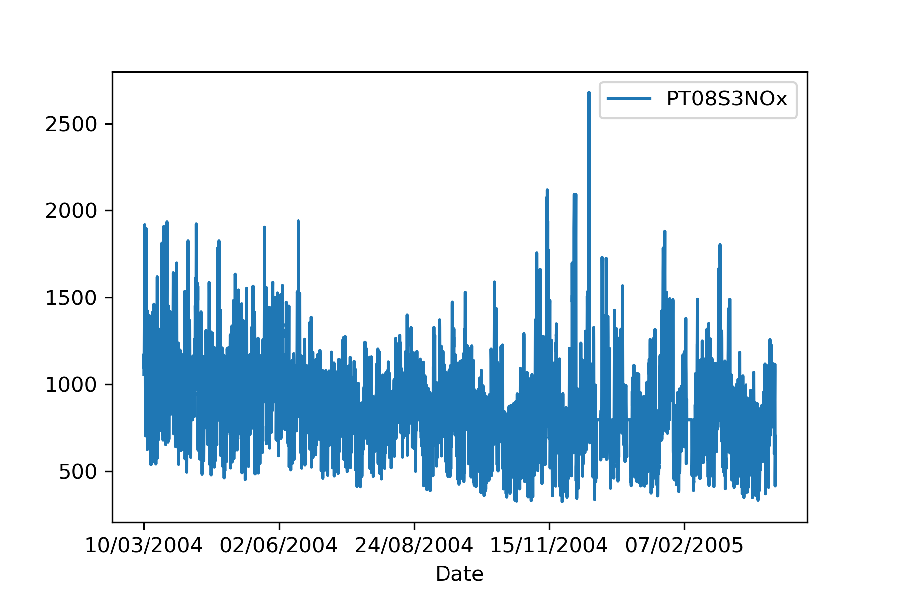
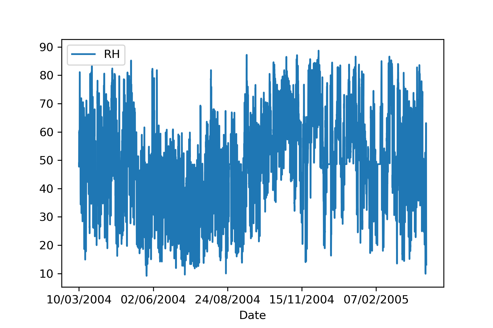
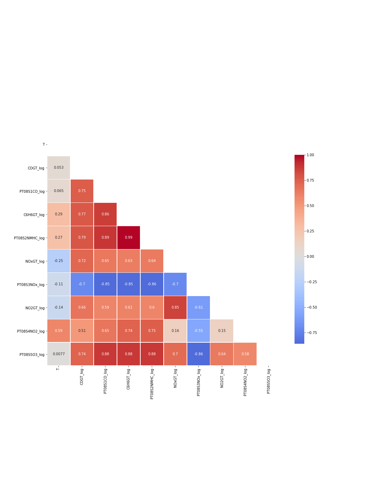

# EFFECTS OF METAL OXIDES IN POSITANO TEMPERATURE 

***Author:*** Ariadna Recasens

## 1. OVERVIEW
This project explores the effect of metal oxides in the temperature of Positano to help the new mayor implement novel regulations. 

## 2. BUSINESS PROBLEM
The new mayor of Positano, a small italian city, is worried about climate change and wants to understand whether metal oxides that are released from the city's industries have an impact in warming climate of the city in order to introduce new regulations.

In this project, we will create a regression linear model to understand the effect of ten metal oxides in Positano's temperature, in order to help the new mayor introduce new regulations to reduce climate change. 

## 3. DATA UNDERSTANDING
This project explores an [Air Quality Data Set](https://archive.ics.uci.edu/ml/datasets/Air+Quality) containing 9358 instances of hourly averaged responses from an array of 5 metal oxide chemical sensors embedded in an Air Quality Chemical Multisensor Device. 

The device was located on the field in a significantly polluted area, at road level,within an Italian city. 

Data were recorded from March 2004 to February 2005 (one year) representing the longest freely available recordings of on field deployed air quality chemical sensor devices responses. 

Missing values are tagged with -200 value.

**Attribute Information**:
1. Date (DD/MM/YYYY)
1. Time (HH.MM.SS)
1. True hourly averaged concentration CO in mg/m^3 (reference analyzer)
1. PT08.S1 (tin oxide) hourly averaged sensor response (nominally CO targeted)
1. True hourly averaged overall Non Metanic HydroCarbons concentration in microg/m^3 (reference analyzer)
1. True hourly averaged Benzene concentration in microg/m^3 (reference analyzer)
1. PT08.S2 (titania) hourly averaged sensor response (nominally NMHC targeted)
1. True hourly averaged NOx concentration in ppb (reference analyzer)
1. PT08.S3 (tungsten oxide) hourly averaged sensor response (nominally NOx targeted)
1. True hourly averaged NO2 concentration in microg/m^3 (reference analyzer)
1. PT08.S4 (tungsten oxide) hourly averaged sensor response (nominally NO2 targeted)
1. PT08.S5 (indium oxide) hourly averaged sensor response (nominally O3 targeted)
1. Temperature in °C
1. Relative Humidity (%)
1. AH Absolute Humidity

## 4. METHODS 
1. Data exploration: How do variables change over time?
1. Data exploration: how did the average of each variables change between 2014 and 2015?
1. Data exploration: How do the variables correlate between each other?
1. Linear regression model: Iteration process to imporve the model by studying multicolinearity and interactions. The model has been validate using train and testing subset. 

## 5. RESULTS

### Change of variables over time:

### Comparision of averages between 2014 and 2015 
| Variable | Average 2014 | Average 2015 |
| --- | --- | --- |
| CO(GT) | 2.036723 | 2.030975 |
| Tin oxide - PT08.S1(CO) | 1061.597046 | 1041.919893 |
| Non Metanic HydroCarbons - NMHC(GT) | 29.435724 |1.500000 |
| Benzene - C6H6(GT) | 10.338383 | 7.877303 |
| Titania - PT08.S2(NMHC) | 930.068214 | 815.172230 |
| NOx - NOx(GT) | 170.898312 | 308.375834 |
| tungsten oxide - PT08.S3(NOx)| 828.916174 | 720.461949 |
| NO2 - NO2(GT) | 79.611744 | 137.482198 |
| Tungsten oxide -  PT08.S4(NO2)| 1502.120956 | 1074.207388 |
| indium oxide - PT08.S5(O3) | 980.447117 | 990.885180 |
| Temperature - (T) | 20.240605 | 9.494393 |
| Relative humidty (RH)  - PT08S5O3 | 46.753657 | 49.308055 |
| Absolute humidty (AH) | 1.151260 | 0.704977 |

### Variables correlation

### Linear regression model
R-squared = 0.951

**Variables that significantly and positively correlate with Temperature** 
| Variable | Coefficient |
| --- | --- | 
| PT08.S2(NMHC) | 23.803690 |
| NO2(GT) | 1.610673 |
| PT08.S4(NO2) | 9.396746 |

**Variables that significantly and negatively correlate with Temperature** 

| Variable | Coefficient |
| --- | --- |
| CO(GT) | -0.489987 |
| PT08.S1(CO) | -6.249633 |
| NMHC(GT) | -1.112450 |
| C6H6(GT) | -16.886120 |
| NOx(GT) | -2.361071 |
| PT08.S3(NOx) | -2.201539 |
| PT08.S5(O3) | -6.403627 |

## CONCLUSIONS
* All the metal oxides studied in this model significantly affect T in Positano.
* Titania (PT08.S2), NO2 and tungsten oxide (nominally NO2 targeted) positvely contribute to T raise (the more concetration of these oxides, the more temperature), being Titania the one with a highest negative impact. 
* CO, tin oxide, Non Metanic HydroCarbons, Benzene, indium oxide and tungsten oxide (nominally NOx targeted) negatively contribute to T (the more concentration of these oxides, the less T), being Benzene the one with a highest positive impact. 

## BUSINES RECOMENDATIONS
We observe that there was a big drop of Temperature between 2014 and 2015, being the T average in 2014 of 20.240605 Celsius vs 9.494393 Celsius in 2015. This 10C difference could be an indicator that the T sensor was damage. We would recommend to check the Tempearture Sensor and repeat the study with new collected data.

In terms of regulation, since Titania is the one that contributes the most to Temperature increase, we recommend that the new regulations aim to reduce the emissions of Titania. 

